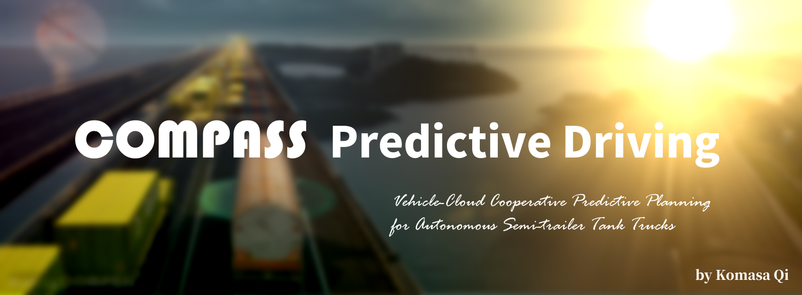

<h3>COMPASS: Cloud-based Predictive Planning for Autonomous Semi-trailer Tank Trucks</h3>

[Komasa Qi](https://github.com/KomasaQi), School of Vehicle and Mobility, Tsinghua University

🌟 **Simulation for Matlab and SUMO**

The official implementation of the on cloud predictive planning for vehicle-road-cloud integrated control system. 

  

  

## Table of Contents

- [Methods](#methods)
- [Closed-loop Performance](#closed-loop-performance)
   - [Simulation Cases](#simulation-cases)
   - [Qualitative Results](#qualitative-results)
- [Getting Started](#getting-started)
  - [Prerequisites](#prerequisites)
  - [Run Simulations](#run-simulations)

## Methods

## Closed-loop Performance

### Simulation Cases

### Qualitative Results

## Getting Started

### Prerequisites

### Run Simulations

## To Do List

The code is under cleaning and will be released gradually.

- [x] maps setup
- [ ] basic runtime packaging
- [ ] runtime debug
- [ ] adding uncertainty calculation
- [ ] integrate with trailer-MEI
- [ ] guidance tutorial

